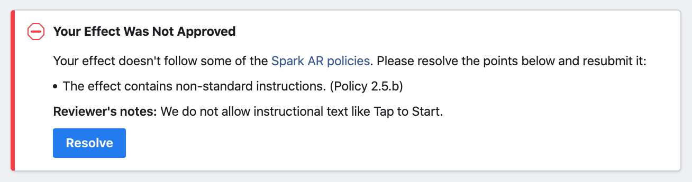

# "Programming Language" IG Effect

**Creators:** Sonny Li & Can Chu

**Research:**

| Effect       | Creator         | Random | Sound | Facial Animation
| ------------- |:-------------:|:---:|:---:|:---:|
| Which Disney? | [arnopartissimo](https://www.instagram.com/arnopartissimo) | 4 sec | No | No |
| What Pokemon? | [hughesp1](https://www.instagram.com/hughesp1) |   5 sec | Yes | Yes |
| Which Simpson? | [hughesp1](https://www.instagram.com/hughesp1) |  5 sec | Yes | Yes |
| Which emoji are you? | [hughesp1](https://www.instagram.com/hughesp1) | 3 sec | No | Yes |

v1.0:
- 

- 

v1.1:
-

- name of filter: "Programming Language"
- Added effect icon
- Added language choice (added lolcode, fortran)

submit for review

1/30/2020:

- Effect not approved

v1.2
-

- Changed "Question" image and took out "(tap to start)"
- Took out `tap screen` and added `Delay` Added video recording and delay patch
- Resubmit effect
